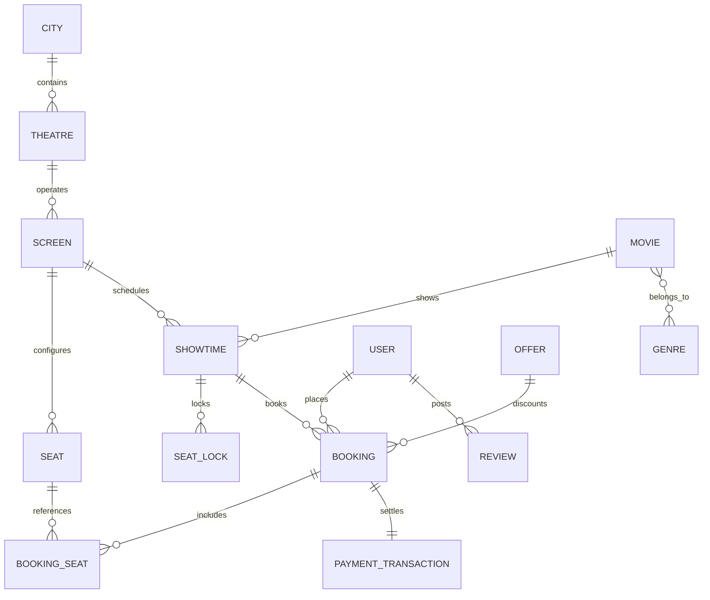
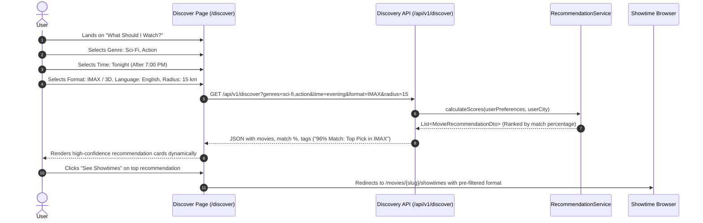
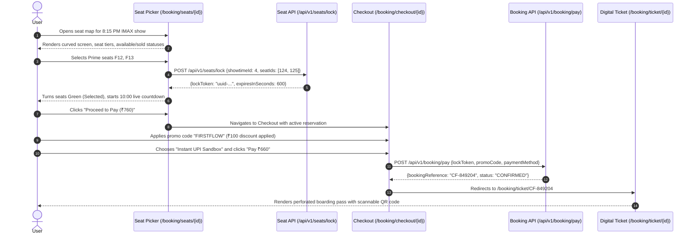
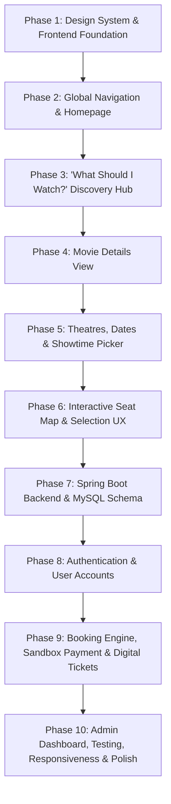

# CinemaFlow: Java / Spring Boot Architecture & Implementation Plan

CinemaFlow is a commercial-grade movie discovery and ticket-booking platform developed with **Java, Spring Boot, Spring Data JPA, Hibernate, MySQL, Thymeleaf, HTML5, CSS3, and Vanilla JavaScript**.

It features an intelligent **"What Should I Watch?"** recommendation engine powered by a deterministic multi-attribute scoring algorithm, an interactive curved-screen seat map with temporary concurrency locking, and digital boarding-pass tickets with scannable QR codes.

---

## 1. High-Level Architecture

CinemaFlow follows a **Clean Layered Architecture** with strict separation of concerns. The application uses a hybrid rendering model: **Thymeleaf Server-Side Rendering (SSR)** for structural pages and SEO, combined with **RESTful JSON micro-interactions** via Vanilla JavaScript for dynamic workflows (seat maps, live locks, live filters, and checkout).

```mermaid
graph TD
    Client[Browser: HTML5 / CSS3 / Vanilla JS]

    subgraph Presentation Layer [Spring Boot MVC Web Layer]
        ThymeleafController[Spring MVC @Controller: Thymeleaf SSR Views]
        RestController[Spring REST @RestController: JSON Endpoints /api/v1/*]
        StaticResources[Static Assets: tokens.css, JS modules, SVGs]
    end

    subgraph Service Layer [Business & Domain Logic]
        RecommendationService[Deterministic Recommendation Engine]
        BookingService[Booking & Order Orchestration]
        SeatLockService[Concurrency & Temporary Seat Lease Engine]
        PaymentSimulationService[Sandbox Payment Processing]
        TicketService[Digital Boarding Pass & QR Code Generator]
        AuthService[User Account & Security Service]
    end

    subgraph Persistence Layer [Spring Data JPA / Hibernate]
        Repositories[Spring Data JPA Repositories]
        Entities[JPA Entities / Mappings / Enums]
    end

    subgraph Database Layer [Relational Storage]
        MySQL[(MySQL InnoDB Database)]
    end

    Client <-->|HTTP GET HTML Pages| ThymeleafController
    Client <-->|Fetch API / JSON Requests| RestController
    ThymeleafController --> Service Layer
    RestController --> Service Layer
    Service Layer --> Repositories
    Repositories --> Entities
    Entities <--> MySQL
```

### Architectural Principles:
1. **Controller Layer**: Handles HTTP requests, parameter validation (`@Valid`), security context resolution, and either populates the Thymeleaf `Model` or returns typed JSON DTOs (`ResponseEntity<T>`).
2. **Service Layer**: Pure Java domain logic. No HTTP concepts or raw database queries leak into this layer. Transactions are managed declaratively using `@Transactional`.
3. **Repository Layer**: Extends `JpaRepository<T, ID>`, utilizing derived query methods, JPQL `@Query`, and optimistic/pessimistic locking where needed for seat reservations.
4. **Persistence Layer**: Relational mapping through JPA / Hibernate with explicit MySQL column types, foreign key constraints, cascade controls, and lazy loading.
5. **Deterministic Recommendation Engine**: A transparent multi-factor scoring algorithm calculating match percentages (0–100%) based on explicit user preferences (genre weights, time slot proximity, format match, language preference, and theatre distance).

---

## 2. Recommended Project & Folder Structure

```
MovieBooking/
│
├── pom.xml                                  # Maven project configuration
├── mvnw / mvnw.cmd                          # Maven wrapper binaries
│
├── src/
│   ├── main/
│   │   ├── java/
│   │   │   └── com/
│   │   │       └── cinemaflow/
│   │   │           ├── CinemaFlowApplication.java   # Spring Boot entry point
│   │   │           │
│   │   │           ├── config/                      # Infrastructure & Spring Configs
│   │   │           │   ├── SecurityConfig.java      # Auth & CSRF configuration
│   │   │           │   ├── WebMvcConfig.java        # Resource handlers & formatters
│   │   │           │   └── JpaConfig.java           # Auditing & transaction setup
│   │   │           │
│   │   │           ├── controller/                  # Presentation Controllers
│   │   │           │   ├── HomeController.java      # Homepage, city selector
│   │   │           │   ├── DiscoveryController.java # "What Should I Watch?" SSR view
│   │   │           │   ├── MovieController.java     # Movie details & showtimes SSR
│   │   │           │   ├── BookingViewController.java # Seat picker, checkout, ticket SSR
│   │   │           │   ├── AuthController.java      # Login, registration, profile SSR
│   │   │           │   ├── AdminController.java     # Backoffice management views
│   │   │           │   └── api/                     # REST API Controllers (JSON)
│   │   │           │       ├── DiscoveryApiController.java # Recommendation & filter API
│   │   │           │       ├── ShowtimeApiController.java  # Theatres & showtimes JSON
│   │   │           │       ├── SeatApiController.java      # Seat map & live lock API
│   │   │           │       └── BookingApiController.java   # Coupons & payment checkout API
│   │   │           │
│   │   │           ├── service/                     # Service Layer (Interfaces & Impls)
│   │   │           │   ├── MovieService.java
│   │   │           │   ├── ShowtimeService.java
│   │   │           │   ├── RecommendationService.java   # Scoring algorithm
│   │   │           │   ├── SeatLockService.java         # 10-min locking & expiry
│   │   │           │   ├── BookingService.java          # Order lifecycle
│   │   │           │   ├── PaymentSimulationService.java
│   │   │           │   ├── TicketService.java           # Boarding pass & QR builder
│   │   │           │   └── UserService.java
│   │   │           │
│   │   │           ├── repository/                  # Spring Data JPA Repositories
│   │   │           │   ├── CityRepository.java
│   │   │           │   ├── TheatreRepository.java
│   │   │           │   ├── ScreenRepository.java
│   │   │           │   ├── SeatRepository.java
│   │   │           │   ├── MovieRepository.java
│   │   │           │   ├── GenreRepository.java
│   │   │           │   ├── ShowtimeRepository.java
│   │   │           │   ├── SeatLockRepository.java
│   │   │           │   ├── BookingRepository.java
│   │   │           │   ├── OfferRepository.java
│   │   │           │   └── UserRepository.java
│   │   │           │
│   │   │           ├── model/                       # JPA Entities
│   │   │           │   ├── City.java
│   │   │           │   ├── Theatre.java
│   │   │           │   ├── Screen.java
│   │   │           │   ├── Seat.java
│   │   │           │   ├── Movie.java
│   │   │           │   ├── Genre.java
│   │   │           │   ├── Showtime.java
│   │   │           │   ├── SeatLock.java
│   │   │           │   ├── Booking.java
│   │   │           │   ├── BookingSeat.java
│   │   │           │   ├── PaymentTransaction.java
│   │   │           │   ├── Offer.java
│   │   │           │   ├── Review.java
│   │   │           │   └── User.java
│   │   │           │
│   │   │           ├── dto/                         # Data Transfer Objects
│   │   │           │   ├── request/
│   │   │           │   │   ├── DiscoveryFilterRequest.java
│   │   │           │   │   ├── SeatLockRequest.java
│   │   │           │   │   ├── CheckoutRequest.java
│   │   │           │   │   └── UserRegistrationRequest.java
│   │   │           │   └── response/
│   │   │           │       ├── MovieRecommendationDto.java
│   │   │           │       ├── SeatMapDto.java
│   │   │           │       ├── SeatStatusDto.java
│   │   │           │       ├── BookingSummaryDto.java
│   │   │           │       └── ApiResponse.java
│   │   │           │
│   │   │           ├── exception/                   # Error Handling
│   │   │           │   ├── GlobalExceptionHandler.java
│   │   │           │   ├── ResourceNotFoundException.java
│   │   │           │   ├── SeatAlreadyLockedException.java
│   │   │           │   └── BookingExpiredException.java
│   │   │           │
│   │   │           └── util/                        # Utility Helpers
│   │   │               ├── QrCodeGenerator.java     # ZXing SVG/PNG QR builder
│   │   │               ├── DistanceCalculator.java  # Haversine formula
│   │   │               └── BookingReferenceGenerator.java
│   │   │
│   │   └── resources/
│   │       ├── application.yml                      # MySQL datasource & JPA settings
│   │       ├── schema.sql                           # DDL bootstrap (optional fallback)
│   │       ├── data.sql                             # Seeded movies, theatres, screens
│   │       │
│   │       ├── templates/                           # Thymeleaf Server-Side Templates
│   │       │   ├── fragments/                       # Reusable UI fragments
│   │       │   │   ├── header.html                  # Global nav, city selector, search
│   │       │   │   ├── footer.html                  # Brand footer & links
│   │       │   │   ├── movie-card.html              # Standard movie poster card
│   │       │   │   ├── theatre-card.html            # Theatre listing with showtime pills
│   │       │   │   └── toast.html                   # Alert banner component
│   │       │   ├── layouts/
│   │       │   │   ├── main-layout.html             # Master layout skeleton
│   │       │   │   └── admin-layout.html            # Admin dashboard shell
│   │       │   ├── pages/
│   │       │   │   ├── index.html                   # Homepage
│   │       │   │   ├── discover.html                # "What Should I Watch?" Hub
│   │       │   │   ├── movie-details.html           # Movie synopsis, cast, trailers
│   │       │   │   ├── showtimes.html               # Date & theatre showtime browser
│   │       │   │   ├── seat-picker.html             # Interactive seat map & lock
│   │       │   │   ├── checkout.html                # Summary, promo, simulated pay
│   │       │   │   ├── digital-ticket.html          # Boarding pass & QR code ticket
│   │       │   │   ├── login.html                   # User login
│   │       │   │   ├── register.html                # User registration
│   │       │   │   └── profile.html                 # Booking history & active tickets
│   │       │   └── admin/
│   │       │       ├── dashboard.html               # Occupancy metrics & shortcuts
│   │       │       ├── movie-management.html        # CRUD movies
│   │       │       └── showtime-management.html     # Schedule showtimes
│   │       │
│   │       └── static/                              # Static Frontend Assets
│   │           ├── css/
│   │           │   ├── tokens.css                   # Design tokens (colors, fonts, radii)
│   │           │   ├── reset.css                    # Modern baseline reset
│   │           │   ├── typography.css               # Font scales & pairings
│   │           │   ├── layout.css                   # Grid, container, header, footer
│   │           │   ├── components/
│   │           │   │   ├── buttons.css
│   │           │   │   ├── cards.css
│   │           │   │   ├── forms.css
│   │           │   │   ├── badges.css
│   │           │   │   ├── modals.css
│   │           │   │   ├── seat-map.css             # Cinema screen & seat styling
│   │           │   │   └── ticket.css               # Boarding pass styling
│   │           │   └── pages/
│   │           │       ├── home.css
│   │           │       ├── discover.css
│   │           │       ├── movie-details.css
│   │           │       ├── showtimes.css
│   │           │       ├── seat-picker.css
│   │           │       └── checkout.css
│   │           ├── js/
│   │           │   ├── core/
│   │           │   │   ├── api-client.js            # Fetch wrapper with CSRF & error logic
│   │           │   │   ├── toast.js                 # Micro toast notifications
│   │           │   │   └── modal.js                 # Dialog controller
│   │           │   └── pages/
│   │           │       ├── discover.js              # Live recommendation questionnaire
│   │           │       ├── seat-picker.js           # Multi-seat selection & countdown timer
│   │           │       ├── checkout.js              # Promo validator & sandbox pay
│   │           │       └── ticket.js                # Print / save boarding pass
│   │           ├── images/                          # Post-processed posters, brand marks
│   │           └── icons/                           # Curated SVG icons (amenities, formats)
│   │
│   └── test/
│       └── java/
│           └── com/
│               └── cinemaflow/
│                   ├── service/
│                   │   ├── RecommendationServiceTest.java
│                   │   ├── SeatLockServiceTest.java
│                   │   └── BookingServiceTest.java
│                   └── controller/
│                       └── DiscoveryApiControllerTest.java
```

---

## 3. Maven Dependencies (`pom.xml`)

```xml
<?xml version="1.0" encoding="UTF-8"?>
<project xmlns="http://maven.apache.org/POM/4.0.0"
         xmlns:xsi="http://www.w3.org/2001/XMLSchema-instance"
         xsi:schemaLocation="http://maven.apache.org/POM/4.0.0 https://maven.apache.org/xsd/maven-4.0.0.xsd">
    <modelVersion>4.0.0</modelVersion>

    <parent>
        <groupId>org.springframework.boot</groupId>
        <artifactId>spring-boot-starter-parent</artifactId>
        <version>3.2.5</version>
        <relativePath/>
    </parent>

    <groupId>com.cinemaflow</groupId>
    <artifactId>cinemaflow</artifactId>
    <version>1.0.0-SNAPSHOT</version>
    <name>CinemaFlow</name>
    <description>Movie Discovery &amp; Ticket Booking Platform</description>

    <properties>
        <java.version>17</java.version>
        <zxing.version>3.5.3</zxing.version>
    </properties>

    <dependencies>
        <!-- Spring Boot Starters -->
        <dependency>
            <groupId>org.springframework.boot</groupId>
            <artifactId>spring-boot-starter-web</artifactId>
        </dependency>
        <dependency>
            <groupId>org.springframework.boot</groupId>
            <artifactId>spring-boot-starter-thymeleaf</artifactId>
        </dependency>
        <dependency>
            <groupId>org.springframework.boot</groupId>
            <artifactId>spring-boot-starter-data-jpa</artifactId>
        </dependency>
        <dependency>
            <groupId>org.springframework.boot</groupId>
            <artifactId>spring-boot-starter-validation</artifactId>
        </dependency>
        <dependency>
            <groupId>org.springframework.boot</groupId>
            <artifactId>spring-boot-starter-security</artifactId>
        </dependency>

        <!-- MySQL Driver -->
        <dependency>
            <groupId>com.mysql</groupId>
            <artifactId>mysql-connector-j</artifactId>
            <scope>runtime</scope>
        </dependency>

        <!-- QR Code Generation for Digital Tickets -->
        <dependency>
            <groupId>com.google.zxing</groupId>
            <artifactId>core</artifactId>
            <version>${zxing.version}</version>
        </dependency>
        <dependency>
            <groupId>com.google.zxing</groupId>
            <artifactId>javase</artifactId>
            <version>${zxing.version}</version>
        </dependency>

        <!-- Development & Testing -->
        <dependency>
            <groupId>org.springframework.boot</groupId>
            <artifactId>spring-boot-devtools</artifactId>
            <scope>runtime</scope>
            <optional>true</optional>
        </dependency>
        <dependency>
            <groupId>org.springframework.boot</groupId>
            <artifactId>spring-boot-starter-test</artifactId>
            <scope>test</scope>
        </dependency>
        <dependency>
            <groupId>org.springframework.security</groupId>
            <artifactId>spring-security-test</artifactId>
            <scope>test</scope>
        </dependency>
    </dependencies>

    <build>
        <plugins>
            <plugin>
                <groupId>org.springframework.boot</groupId>
                <artifactId>spring-boot-maven-plugin</artifactId>
            </plugin>
        </plugins>
    </build>
</project>
```

---

## 4. Database Entities and Relationships (MySQL)



### Entity Specifications

1. **`City`** (`cities`)
   - `id`: `BIGINT AUTO_INCREMENT PRIMARY KEY`
   - `name`: `VARCHAR(100) NOT NULL`
   - `slug`: `VARCHAR(100) NOT NULL UNIQUE`
   - `state`: `VARCHAR(100) NOT NULL`
   - `latitude`: `DECIMAL(10, 7) NOT NULL`
   - `longitude`: `DECIMAL(10, 7) NOT NULL`
   - `is_active`: `BOOLEAN DEFAULT TRUE`

2. **`Theatre`** (`theatres`)
   - `id`: `BIGINT AUTO_INCREMENT PRIMARY KEY`
   - `city_id`: `BIGINT NOT NULL`, FK -> `cities(id)`
   - `name`: `VARCHAR(150) NOT NULL`
   - `brand`: `VARCHAR(100) NOT NULL` (e.g., "CinemaFlow Luxe", "CinemaFlow PXL")
   - `address`: `VARCHAR(255) NOT NULL`
   - `latitude`: `DECIMAL(10, 7) NOT NULL`
   - `longitude`: `DECIMAL(10, 7) NOT NULL`
   - `amenities`: `VARCHAR(255)` (CSV/JSON representation: "Dolby Atmos, Gourmet Lounge, Recliner, Valet")
   - `cancellation_allowed`: `BOOLEAN DEFAULT TRUE`

3. **`Screen`** (`screens`)
   - `id`: `BIGINT AUTO_INCREMENT PRIMARY KEY`
   - `theatre_id`: `BIGINT NOT NULL`, FK -> `theatres(id)`
   - `screen_number`: `INT NOT NULL`
   - `name`: `VARCHAR(100) NOT NULL` (e.g., "Screen 1 - 4K Atmos Laser")
   - `sound_system`: `VARCHAR(100) NOT NULL` (e.g., "Dolby Atmos 7.1")
   - `projection_format`: `VARCHAR(50) NOT NULL` (e.g., "IMAX Laser", "RealD 3D", "2D Standard")
   - `total_seats`: `INT NOT NULL`

4. **`Seat`** (`seats`)
   - `id`: `BIGINT AUTO_INCREMENT PRIMARY KEY`
   - `screen_id`: `BIGINT NOT NULL`, FK -> `screens(id)`
   - `row_identifier`: `VARCHAR(5) NOT NULL` (e.g., "A", "B", "C")
   - `seat_number`: `INT NOT NULL`
   - `tier`: `ENUM('CLASSIC', 'PRIME', 'RECLINER', 'WHEELCHAIR') NOT NULL`
   - `price_multiplier`: `DECIMAL(3, 2) DEFAULT 1.00`
   - `is_active`: `BOOLEAN DEFAULT TRUE`
   - *Index*: Unique composite `(screen_id, row_identifier, seat_number)`

5. **`Movie`** (`movies`)
   - `id`: `BIGINT AUTO_INCREMENT PRIMARY KEY`
   - `title`: `VARCHAR(200) NOT NULL`
   - `slug`: `VARCHAR(200) NOT NULL UNIQUE`
   - `synopsis`: `TEXT NOT NULL`
   - `duration_minutes`: `INT NOT NULL`
   - `censor_rating`: `VARCHAR(10) NOT NULL` (e.g., "U", "UA 13+", "A")
   - `languages`: `VARCHAR(200) NOT NULL` (e.g., "English, Hindi, Telugu")
   - `release_date`: `DATE NOT NULL`
   - `poster_url`: `VARCHAR(500) NOT NULL`
   - `backdrop_url`: `VARCHAR(500) NOT NULL`
   - `trailer_youtube_id`: `VARCHAR(50)`
   - `avg_rating`: `DECIMAL(3, 1) DEFAULT 0.0`
   - `rating_count`: `INT DEFAULT 0`
   - `status`: `ENUM('NOW_SHOWING', 'UPCOMING', 'ARCHIVED') NOT NULL`

6. **`Genre`** & **`MovieGenre`** (`genres`, `movie_genres`)
   - `genres`: `id` (PK), `name` (e.g., "Sci-Fi", "Action", "Drama"), `slug` (Unique), `icon_name`
   - `movie_genres`: `movie_id`, `genre_id` (Composite PK)

7. **`Showtime`** (`showtimes`)
   - `id`: `BIGINT AUTO_INCREMENT PRIMARY KEY`
   - `movie_id`: `BIGINT NOT NULL`, FK -> `movies(id)`
   - `screen_id`: `BIGINT NOT NULL`, FK -> `screens(id)`
   - `start_time`: `DATETIME NOT NULL`
   - `end_time`: `DATETIME NOT NULL`
   - `format`: `VARCHAR(30) NOT NULL` (e.g., "2D", "3D", "IMAX 3D", "4DX")
   - `language`: `VARCHAR(50) NOT NULL`
   - `base_price`: `DECIMAL(10, 2) NOT NULL`
   - `status`: `ENUM('OPEN', 'FAST_FILLING', 'ALMOST_FULL', 'SOLD_OUT', 'CANCELLED') NOT NULL`
   - *Index*: `(movie_id, start_time)`, `(screen_id, start_time)`

8. **`SeatLock`** (`seat_locks`) — *Concurrency Guard*
   - `id`: `BIGINT AUTO_INCREMENT PRIMARY KEY`
   - `showtime_id`: `BIGINT NOT NULL`, FK -> `showtimes(id)`
   - `seat_id`: `BIGINT NOT NULL`, FK -> `seats(id)`
   - `lock_token`: `VARCHAR(64) NOT NULL` (Unique UUID for the user session)
   - `user_id`: `BIGINT`, FK -> `users(id)` (Nullable for guest checkout)
   - `locked_at`: `DATETIME NOT NULL`
   - `expires_at`: `DATETIME NOT NULL`
   - *Index*: Unique composite `(showtime_id, seat_id)`, index on `(expires_at)`

9. **`Booking`** (`bookings`)
   - `id`: `BIGINT AUTO_INCREMENT PRIMARY KEY`
   - `booking_reference`: `VARCHAR(20) NOT NULL UNIQUE` (e.g., `CF-849204`)
   - `user_id`: `BIGINT`, FK -> `users(id)`
   - `showtime_id`: `BIGINT NOT NULL`, FK -> `showtimes(id)`
   - `customer_name`: `VARCHAR(100) NOT NULL`
   - `customer_email`: `VARCHAR(150) NOT NULL`
   - `customer_phone`: `VARCHAR(20) NOT NULL`
   - `subtotal_amount`: `DECIMAL(10, 2) NOT NULL`
   - `convenience_fee`: `DECIMAL(10, 2) NOT NULL`
   - `tax_amount`: `DECIMAL(10, 2) NOT NULL`
   - `discount_amount`: `DECIMAL(10, 2) DEFAULT 0.00`
   - `total_amount`: `DECIMAL(10, 2) NOT NULL`
   - `status`: `ENUM('INITIATED', 'CONFIRMED', 'CANCELLED', 'EXPIRED') NOT NULL`
   - `created_at`: `DATETIME NOT NULL`
   - `cancelled_at`: `DATETIME`

10. **`BookingSeat`** (`booking_seats`)
    - `id`: `BIGINT AUTO_INCREMENT PRIMARY KEY`
    - `booking_id`: `BIGINT NOT NULL`, FK -> `bookings(id)`
    - `seat_id`: `BIGINT NOT NULL`, FK -> `seats(id)`
    - `tier`: `VARCHAR(30) NOT NULL`
    - `unit_price`: `DECIMAL(10, 2) NOT NULL`

11. **`PaymentTransaction`** (`payment_transactions`)
    - `id`: `BIGINT AUTO_INCREMENT PRIMARY KEY`
    - `booking_id`: `BIGINT NOT NULL UNIQUE`, FK -> `bookings(id)`
    - `transaction_reference`: `VARCHAR(50) NOT NULL UNIQUE`
    - `payment_method`: `ENUM('UPI', 'CREDIT_CARD', 'DEBIT_CARD', 'NET_BANKING') NOT NULL`
    - `amount`: `DECIMAL(10, 2) NOT NULL`
    - `status`: `ENUM('SUCCESS', 'PENDING', 'FAILED', 'REFUNDED') NOT NULL`
    - `created_at`: `DATETIME NOT NULL`

12. **`Offer`** (`offers`)
    - `id`: `BIGINT AUTO_INCREMENT PRIMARY KEY`
    - `code`: `VARCHAR(30) NOT NULL UNIQUE` (e.g., "FIRSTFLOW", "CINEMA50")
    - `title`: `VARCHAR(100) NOT NULL`
    - `discount_type`: `ENUM('PERCENTAGE', 'FLAT') NOT NULL`
    - `discount_value`: `DECIMAL(10, 2) NOT NULL`
    - `min_booking_amount`: `DECIMAL(10, 2) DEFAULT 0.00`
    - `max_discount_amount`: `DECIMAL(10, 2)`
    - `valid_until`: `DATETIME NOT NULL`
    - `is_active`: `BOOLEAN DEFAULT TRUE`

13. **`User`** (`users`)
    - `id`: `BIGINT AUTO_INCREMENT PRIMARY KEY`
    - `full_name`: `VARCHAR(100) NOT NULL`
    - `email`: `VARCHAR(150) NOT NULL UNIQUE`
    - `password_hash`: `VARCHAR(255) NOT NULL`
    - `phone`: `VARCHAR(20)`
    - `role`: `ENUM('CUSTOMER', 'ADMIN') NOT NULL DEFAULT 'CUSTOMER'`
    - `preferred_city_id`: `BIGINT`, FK -> `cities(id)`
    - `created_at`: `DATETIME NOT NULL`

---

## 5. Main Application Pages & UI States

| Page | Path | Controller View | Key Features |
|---|---|---|---|
| **Homepage** | `/` | `HomeController.index()` | Global Nav, city modal, hero spotlight, "What Should I Watch?" teaser card, Now Showing grid, Coming Soon preview |
| **"What Should I Watch?" Hub** | `/discover` | `DiscoveryController.discover()` | Guided questionnaire + live faceted filter bar; displays real-time match cards with score percentage & nearest theatre counts |
| **Movie Details** | `/movies/{slug}` | `MovieController.details()` | Backdrop hero, synopsis, censor rating, cast & crew cards, embedded trailer modal, critic/user reviews, "Book Tickets" sticky CTA |
| **Theatres & Showtimes** | `/movies/{slug}/showtimes` | `MovieController.showtimes()` | Horizontal 7-day date slider, audio/format filter tags, Theatre cards with distance badge and amenities, showtime pills with availability badges |
| **Interactive Seat Picker** | `/booking/seats/{showtimeId}` | `BookingViewController.seatPicker()` | Curved screen visual indicator, tier price headers (Classic, Prime, Recliner), interactive seat grid, 10:00 live countdown lock timer, bottom order bar |
| **Checkout & Sandbox Pay** | `/booking/checkout/{bookingId}` | `BookingViewController.checkout()` | Reservation countdown timer, itemized cost breakdown (tickets, convenience fee, GST), promo code input, mock payment tabs (UPI QR, Card sandbox) |
| **Digital Boarding Pass** | `/booking/ticket/{bookingId}` | `BookingViewController.ticket()` | Perforated boarding pass visual card, high-contrast scannable QR code, theatre map link, booking reference, calendar & print actions |
| **User Profile & History** | `/profile` | `AuthController.profile()` | Active upcoming tickets, countdown to show, historical receipts, simulated ticket cancellation & refund button |
| **Admin Dashboard** | `/admin/dashboard` | `AdminController.dashboard()` | Real-time seat occupancy stats, active bookings tally, CRUD links for Movies, Screens, Showtimes, and Theatres |

---

## 6. Main User Flows

### Flow 1: Signature "What Should I Watch?" Flow


### Flow 2: Direct Seat Booking & Concurrency Flow


---

## 7. REST / API Requirements

All REST endpoints live under `/api/v1/` and return standardized responses:
`ApiResponse<T> { boolean success, String message, T data, Instant timestamp }`

| Endpoint | Method | Parameters / Body | Purpose |
|---|---|---|---|
| `/api/v1/discover` | `GET` | `cityId`, `genreIds`, `timeWindow`, `format`, `language`, `radiusKm` | Computes match score and returns sorted movie recommendations with nearby theatre counts |
| `/api/v1/theatres/nearby` | `GET` | `cityId`, `lat`, `lng`, `radiusKm` | Returns theatres within radius with calculated distance in kilometers |
| `/api/v1/showtimes/{id}/seats` | `GET` | `showtimeId` (Path) | Returns complete seat matrix for the screen with real-time status: `AVAILABLE`, `LOCKED`, `SOLD` |
| `/api/v1/seats/lock` | `POST` | `{ showtimeId, seatIds, lockToken }` | Atomically locks selected seats for 10 minutes; returns expiration timestamp or errors if conflict occurs |
| `/api/v1/seats/release` | `POST` | `{ lockToken }` | Releases temporary lock if user deselects seats or navigates away |
| `/api/v1/offers/validate` | `POST` | `{ code, orderTotal }` | Validates promo code and returns discount amount |
| `/api/v1/booking/checkout` | `POST` | `{ lockToken, showtimeId, customerName, email, phone, offerCode, paymentMethod }` | Finalizes order, converts locked seats to `CONFIRMED` booking, settles simulated transaction, returns ticket reference |
| `/api/v1/booking/cancel` | `POST` | `{ bookingReference }` | Simulates cancellation if within allowable window, sets status to `CANCELLED`, releases seats |

---

## 8. Deterministic Recommendation Algorithm

The "What Should I Watch?" engine uses a transparent weighted multi-factor formula calculating a **Match Score (0 to 100)**:

$$\text{Score} = (W_{\text{genre}} \times S_{\text{genre}}) + (W_{\text{time}} \times S_{\text{time}}) + (W_{\text{format}} \times S_{\text{format}}) + (W_{\text{lang}} \times S_{\text{lang}}) + (W_{\text{rating}} \times S_{\text{rating}}) - P_{\text{distance}}$$

### Weights & Scoring Breakdown:
1. **Genre Match ($W_{\text{genre}} = 35$)**:
   - 100% if movie has all selected genres.
   - 60% if partial overlap (e.g., user selected Action & Sci-Fi, movie has Action).
2. **Showtime Window ($W_{\text{time}} = 25$)**:
   - Compares user time preference ("Morning", "Afternoon", "Evening (7-11 PM)", "Late Night") against active showtimes today.
   - 100% if showtime starts within the preferred window; 0% if no shows fit.
3. **Format Preference ($W_{\text{format}} = 15$)**:
   - 100% if movie is playing in the requested format (e.g., IMAX 3D, 4DX).
   - 50% if requested format is unavailable but standard 2D is showing.
4. **Language Preference ($W_{\text{lang}} = 15$)**:
   - 100% if audio track matches user preference.
5. **Critique / Audience Rating ($W_{\text{rating}} = 10$)**:
   - Scaled from average rating: $\frac{\text{Rating}}{10.0} \times 100$.
6. **Distance Penalty ($P_{\text{distance}}$)**:
   - Deducts points if nearest theatre playing the movie exceeds preferred radius: $-2 \text{ pts per km beyond radius}$.

---

## 9. Design System Structure (Vanilla CSS)

CinemaFlow avoids generic AI templates (no random gradients, no washed-out purple cards). It uses an authentic cinema visual language: deep charcoal obsidian surfaces, high contrast, crisp typography, and intentional spacing.

### Color Palette Tokens (`tokens.css`)
```css
:root {
  /* Surfaces & Canvas */
  --cf-bg-base: #0B0D13;            /* Deep Obsidian Canvas */
  --cf-bg-surface: #131722;         /* Standard Card Surface */
  --cf-bg-surface-elevated: #1B2132;/* Elevated Card / Modal */
  --cf-bg-surface-hover: #232B40;   /* Interactive Hover Surface */

  /* Cinema Accents */
  --cf-accent-primary: #FF334B;      /* Cinematic Vermilion */
  --cf-accent-primary-hover: #E02037;
  --cf-accent-gold: #F5A623;         /* VIP Tier / Star Ratings */
  --cf-accent-cyan: #00D2FF;         /* IMAX / Sound Badge */
  --cf-accent-success: #10B981;      /* Available / Confirmed */

  /* Seat Map Color Semantics */
  --cf-seat-classic: #475569;        /* Neutral Slate Stroke */
  --cf-seat-prime: #3B82F6;          /* Blue Tint Stroke */
  --cf-seat-recliner: #F5A623;       /* Amber Gold Stroke */
  --cf-seat-selected: #10B981;       /* Electric Green Fill */
  --cf-seat-locked: #FBBF24;         /* Pulsing Amber Fill */
  --cf-seat-sold: #1E293B;           /* Dimmed Slate with Diagonal Notch */

  /* Text Hierarchy */
  --cf-text-primary: #FFFFFF;
  --cf-text-secondary: #94A3B8;
  --cf-text-muted: #64748B;
  --cf-border-subtle: rgba(255, 255, 255, 0.08);
  --cf-border-medium: rgba(255, 255, 255, 0.16);

  /* Spacing Scale (4px increments) */
  --cf-space-1: 4px;
  --cf-space-2: 8px;
  --cf-space-3: 12px;
  --cf-space-4: 16px;
  --cf-space-6: 24px;
  --cf-space-8: 32px;
  --cf-space-12: 48px;

  /* Border Radii */
  --cf-radius-sm: 4px;
  --cf-radius-md: 8px;
  --cf-radius-lg: 12px;
  --cf-radius-full: 9999px;
}
```

### Typography Scale
- **Headings & Display**: Google Font **Outfit** (clean, geometric, modern cinema brand feel).
- **Body & Controls**: Google Font **Inter** (optimal legibility for showtimes, synopsis, and forms).
- **Tickets & Monospace**: Google Font **JetBrains Mono** (booking codes, seat coordinates, timestamps).

---

## 10. Development Phases and Dependencies

We will build the application incrementally across 10 structured phases:



### Phase Breakdown

* **Phase 1: Design System & Frontend Foundation**
  - Establish `tokens.css`, `reset.css`, `typography.css`, and core UI components (buttons, badges, inputs, cards, empty states, shimmer skeletons).
  - Create base template structure and component showcase.
  - *Verification*: Visual inspection of the design system components in desktop and mobile viewports.

* **Phase 2: Global Navigation & Homepage**
  - Global navigation header with search bar, city selector modal, and responsive mobile drawer.
  - Homepage hero spotlight banner, "What Should I Watch?" teaser card, Now Showing carousel/grid, and Coming Soon section.
  - *Verification*: Responsive navigation and layout testing.

* **Phase 3: "What Should I Watch?" Discovery Experience**
  - Interactive multi-step discovery wizard and live faceted filter bar (Genre chips, Language, Time window, Radius slider, Format pills).
  - Dynamic recommendation results with match score indicators ("96% Match").
  - *Verification*: Filter state updates matching cards accurately without page reload.

* **Phase 4: Movie Details**
  - Movie detail page with backdrop trailer launcher, cast & crew cards, synopsis, censor rating, and sticky "Book Tickets" CTA.
  - *Verification*: Rich metadata presentation and responsive behavior.

* **Phase 5: Theatre + Date + Showtime Selection**
  - Sticky 7-day horizontal date selector.
  - Theatre listing grouped with distance indicators, screen amenities, and format pills.
  - Showtime buttons with availability status (Available, Fast Filling, Almost Full).
  - *Verification*: Date switching accurately updates filtered showtimes.

* **Phase 6: Interactive Seat Selection**
  - Curved screen visual representation.
  - Multi-tier seat sections (Classic, Prime, Recliner) with distinct pricing.
  - Interactive seat selection with rules (max 8 seats, prevent orphaned single seats).
  - Live price calculation drawer and 10:00 reservation timer.
  - *Verification*: Seat map toggles, price calculations, and tier constraints verified in browser.

* **Phase 7: Spring Boot Backend & MySQL Database**
  - Configure Maven `pom.xml`, Spring Boot application, and MySQL datasource.
  - Implement all 13 JPA entities and Spring Data JPA repositories.
  - Seed database with realistic movies, theatres, screens, and showtimes via `data.sql`.
  - Connect Thymeleaf views and build REST API endpoints.
  - *Verification*: Backend boots successfully, connects to MySQL, and serves dynamic data.

* **Phase 8: Authentication & User Accounts**
  - Spring Security configuration with BCrypt password hashing.
  - User registration, login, logout, and profile pages.
  - User booking history and preference management.
  - *Verification*: User signup, session persistence, and role-based route protection.

* **Phase 9: Booking + Simulated Payment + Digital Ticket**
  - Implement 10-minute temporary seat locking engine with automatic expiry.
  - Checkout page with coupon code validator and convenience fee calculation.
  - Simulated payment gateway (instant UPI QR / Card sandbox).
  - Scannable digital boarding pass ticket with QR code generation via ZXing.
  - *Verification*: Full end-to-end booking flow from seat selection to confirmed ticket.

* **Phase 10: Admin Dashboard, Testing, Responsiveness & Polish**
  - Backoffice admin screens for managing movies, screens, and showtimes.
  - Comprehensive unit and integration testing (`@DataJpaTest`, `MockMvc`).
  - Mobile responsiveness polish, accessibility audit, and performance optimization.
  - *Verification*: End-to-end smoke test of all user and admin journeys.

---

## 11. Testing Strategy

1. **Unit Testing (JUnit 5 & Mockito)**:
   - `RecommendationServiceTest`: Verify scoring mathematics, weight distribution, and ranking order.
   - `SeatLockServiceTest`: Test lock acquisition, conflict detection on already locked seats, and automatic release of expired locks.
   - `BookingServiceTest`: Test total price calculation (seats + taxes + fees - coupon discount).
   - `DistanceCalculatorTest`: Validate Haversine formula against known coordinates.
2. **Repository Testing (`@DataJpaTest`)**:
   - Validate custom JPQL queries, composite indexes, and cascade operations against test database.
3. **Controller & Integration Testing (`@WebMvcTest` & `MockMvc`)**:
   - Verify HTTP status codes, JSON payload structures, and form validation constraints.
   - Test CSRF protection on API endpoints.
4. **UI & Browser Testing**:
   - Test seat map responsiveness on mobile and tablet screens.
   - Verify modal behaviors, focus trapping, and keyboard navigation.

---

## 12. Frontend & Spring Boot Communication

The frontend communicates with the Spring Boot backend through two complementary channels:

1. **Server-Side Rendering (SSR) via Thymeleaf**:
   - Initial page loads render full semantic HTML with OpenGraph tags, title tags, and server-injected movie lists.
   - Thymeleaf fragments (`th:replace`, `th:insert`) maintain consistent header, footer, and modal layouts.
   - Flash attributes (`RedirectAttributes`) deliver server-side success/error messages across redirects.
2. **Asynchronous REST API via Vanilla JavaScript**:
   - Modern `fetch()` client wrapped in `api-client.js`.
   - Reads CSRF token from `<meta name="_csrf">` and includes `X-CSRF-TOKEN` in POST headers.
   - Handles live updates without full page reloads:
     - Real-time filtering in the "What Should I Watch?" hub.
     - Live seat locking and heartbeat checks.
     - Coupon verification and instant total recalculation.
     - Simulated payment confirmation.
